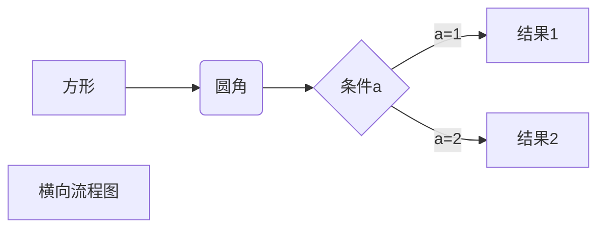
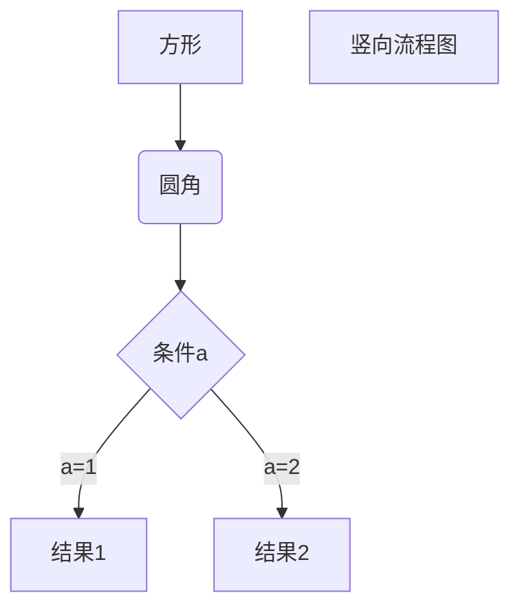
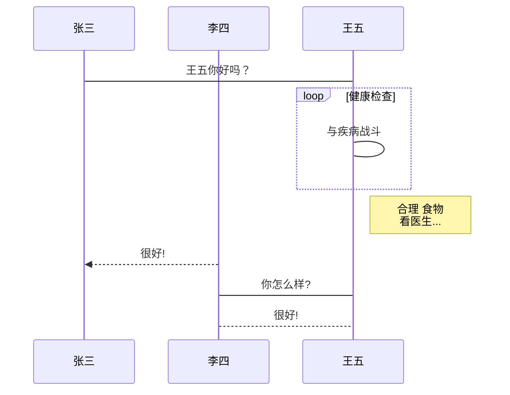
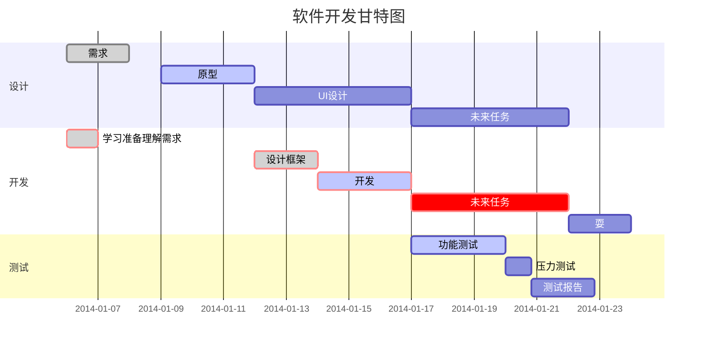

# 目录

# .md语法
*倾斜* or _倾斜_
**加粗** or __加粗__
***加粗 倾斜*** or ___加粗 倾斜___
~~删除线~~


# H1
## H2
### H3
#### H4
##### H5
###### H6

一级标题
=====

二级标题
-----


脚注
------
使用 Markdown[^1]可以效率的书写文档, 直接转换成 HTML[^2], 你可以使用 Typora[^T] 编辑器进行书写。
[^1]:Markdown是一种纯文本标记语言
[^2]:HyperText Markup Language 超文本标记语言
[^T]:NEW WAY TO READ & WRITE MARKDOWN.

下划线
------
<u>abc</u>

列表
------
>加号 生成无序列表
+ a
+ b
+ c

>减号 生成无序列表
- a
- b
- c

>星号 生成无序列表
* a
* b
* c

>>有序
1. abc
2. bcd
3. cde

嵌套
------
>无序
+ 第一章
	+ 1.1
	+ 1.2
	+ 1.3
		+ 1.3.1
+ 第二章
+ 第三章


>有序
1. 第一章
	1. 1.1
	2. 1.2
	3. 1.3
		+ 1.3.1
2. 第二章
3. 第三章

>区块

>>嵌套

代码块
-----
```javascript
<form id="zzk_search" class="navbar-search" action="https://zzk.cnblogs.com/s" method="get">
                        <input name="w" id="zzk_search_input" placeholder="代码改变世界" type="text" tabindex="3" />
                        <button type="submit" id="zzk_search_button">
                            
                        </button>
```

链接
-----
+ 行内式:[百度](https://www.baidu.com "链接描述")
+ 显示地址:<https://www.baidu.com>
参考式:[百度首页]  [id]

[id]: https://www.baidu.com "链接描述"


图片
-----
图片行内式：


图片参考式：
![baidu][logo]

[logo]: https://www.baidu.com/img/PCtm_d9c8750bed0b3c7d089fa7d55720d6cf.png

限制图片宽度：


表格
-----
|head1|head2|head3|
|:----|:----:|----:|
|左对齐|居中对齐|右对齐|


html元素
-----
>目前支持的 HTML 元素有：<kbd> <b> <i> <em> <sup> <sub> <br>等 

使用 <kbd>Ctrl</kbd>+<kbd>Alt</kbd>+<kbd>Del</kbd> 重启电脑
使用 <b>Ctrl</b>+<i>Alt</i>+<em>Del</em> 重启电脑
使用 <sup>Ctrl</sup>+<sub>Alt</sub>+<br>Del</br> 重启电脑


公式
----
>使用两个美元符 $$ 包裹 TeX 或 LaTeX 格式的数学公式来实现

$$
\mathbf{V}_1 \times \mathbf{V}_2 =  \begin{vmatrix} 
\mathbf{i} & \mathbf{j} & \mathbf{k} \\
\frac{\partial X}{\partial u} &  \frac{\partial Y}{\partial u} & 0 \\
\frac{\partial X}{\partial v} &  \frac{\partial Y}{\partial v} & 0 \\
\end{vmatrix}
${$tep1}{\style{visibility:hidden}{(x+1)(x+1)}}
$$

流程图
-----
>具体见





```flow
st=>start: 开始框
op=>operation: 处理框
cond=>condition: 判断框(是或否?)
sub1=>subroutine: 子流程
io=>inputoutput: 输入输出框
e=>end: 结束框
st->op->cond
cond(yes)->io->e
cond(no)->sub1(right)->op
```

```flow
st=>start: 开始框
op=>operation: 处理框
cond=>condition: 判断框(是或否?)
sub1=>subroutine: 子流程
io=>inputoutput: 输入输出框
e=>end: 结束框
st(right)->op(right)->cond
cond(yes)->io(bottom)->e
cond(no)->sub1(right)->op
```

```sequence
对象A->对象B: 对象B你好吗?（请求）
Note right of 对象B: 对象B的描述
Note left of 对象A: 对象A的描述(提示)
对象B-->对象A: 我很好(响应)
对象A->对象B: 你真的好吗？
```

```sequence
Title: 标题：复杂使用
对象A->对象B: 对象B你好吗?（请求）
Note right of 对象B: 对象B的描述
Note left of 对象A: 对象A的描述(提示)
对象B-->对象A: 我很好(响应)
对象B->小三: 你好吗
小三-->>对象A: 对象B找我了
对象A->对象B: 你真的好吗？
Note over 小三,对象B: 我们是朋友
participant C
Note right of C: 没人陪我玩
```




